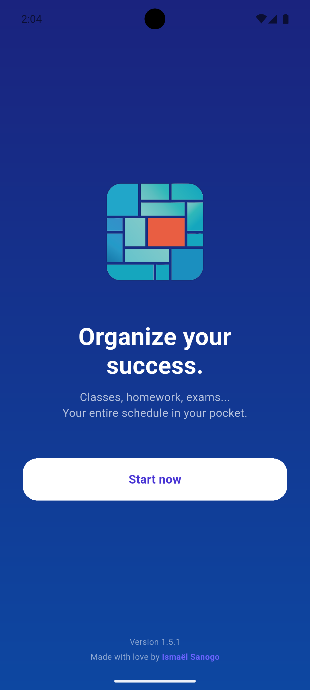
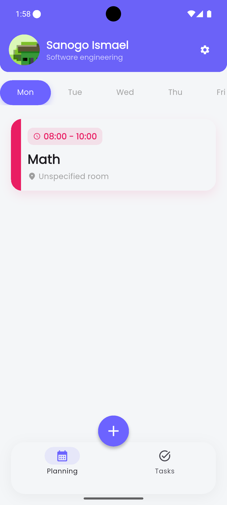
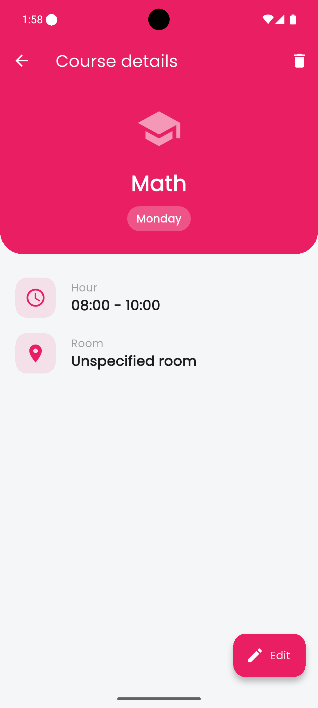
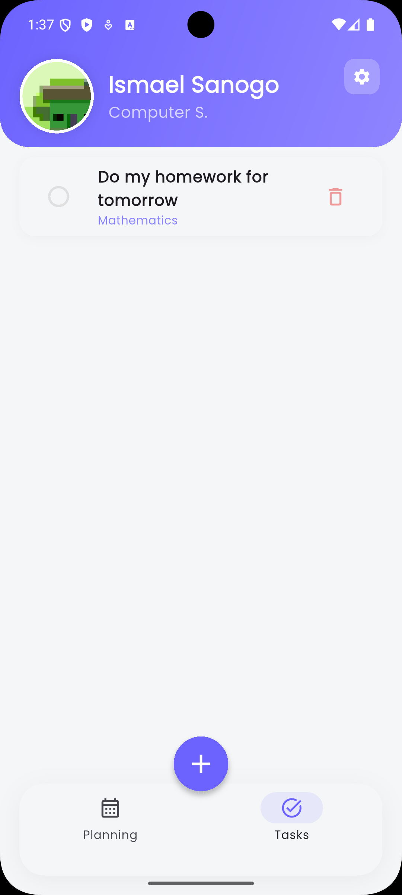
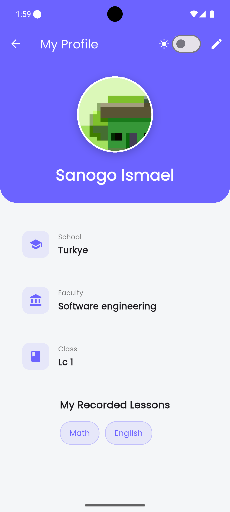
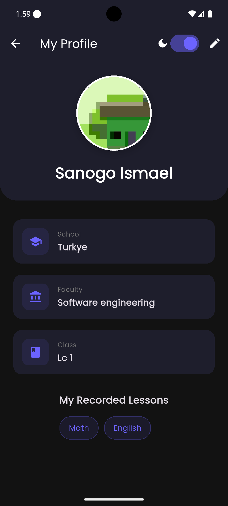

# 🎓 Student Planner (UniFlow)


**UniFlow** is a comprehensive offline mobile application designed to help students organize their academic life. It allows users to manage their schedules, track assignments, and personalize their profiles.

---

## ✨ Main Features

* 📅 **Weekly Planner:** Clear view of classes day by day (Monday to Sunday).
* ✅ **Homework Management:** Smart to-do list. Associate assignments with your subjects and check them off when completed.
* 👤 **Student Profile:** Customize your name, school, class, and profile picture.
* 🎨 **Dynamic Themes:** Full support for **Dark Mode** and **Light Mode**.
* 🌍 **Multilingual:** Available in **French 🇫🇷**, **English 🇺🇸**, and **Turkish 🇹🇷**.
* 🔔 **Notification:** Alert 10 minutes before class.
* 💾 **100% Offline:** All data is persistent thanks to the Hive database.

---

## 📱 Screenshots

| Welcome page | Home (Schedule) |
|:---:|:---:|
|  |  |

| Course details page | Homework Management |
|:---:|:---:|
|  |  |

| Student Profile | Dark Mode |
|:---:|:---:|
|  |  |


---

## 🛠️ Technologies Used

* **Framework:** [Flutter](https://flutter.dev/)
* **Language:** Dart
* **State Management:** [Provider](https://pub.dev/packages/provider)
* **Local Database:** [Hive](https://pub.dev/packages/hive) (NoSQL, fast and lightweight)
* **Internationalization:** flutter_localizations & intl
* **Design:** Google Fonts (Poppins), Hero Animations, Custom Slivers.

---

## 📥 Download the APK

You can test the app on your Android phone by downloading the latest version:

👉 **[Download the latest release](https://github.com/Ismael-sang98/Uni_Flow_app/releases)**

*Choose version `arm64-v8a` for newer phones.*

---

## 🚀 Developer Setup

If you want to clone and modify this project:

1. **Clone the repository:**
```bash
git clone [https://github.com/Ismael-sang98/Uni_Flow_app.git](https://github.com/Ismael-sang98/Uni_Flow_app.git)
```

2. **Install dependencies:**
```bash
flutter pub get
```

3. **Build Hive and translation files:**
```bash
flutter pub run build_runner build --delete-conflicting-outputs
flutter gen-l10n
```

4. **Run the application:**
```bash
flutter run
```

---

Made with ❤️ using Flutter.