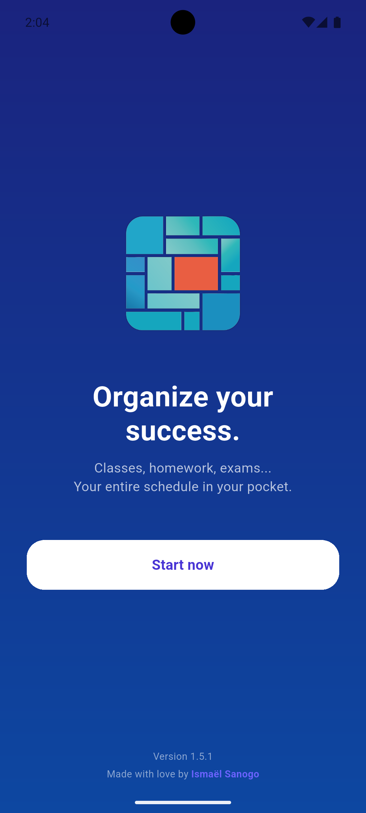
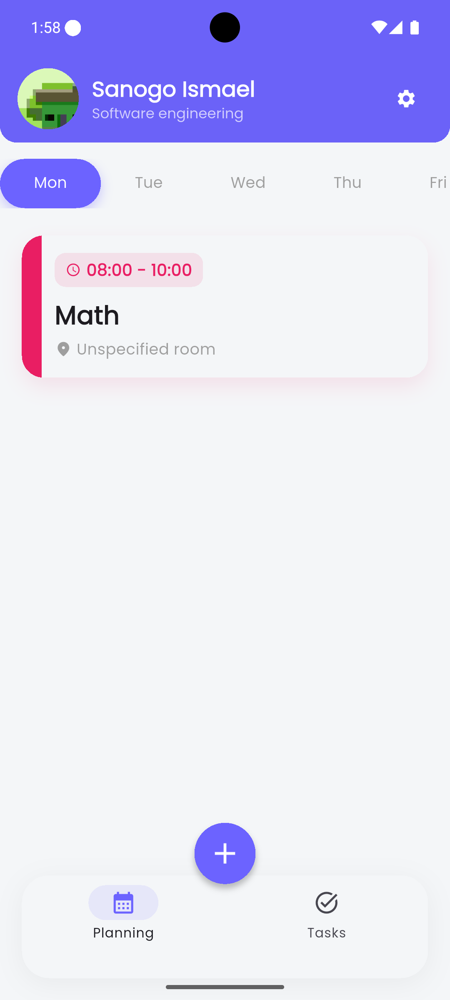
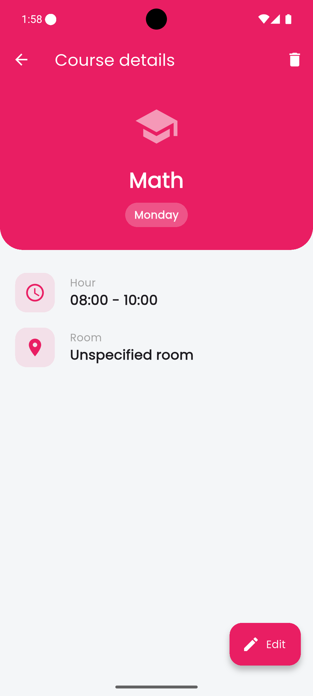
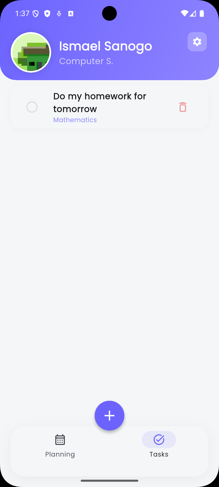
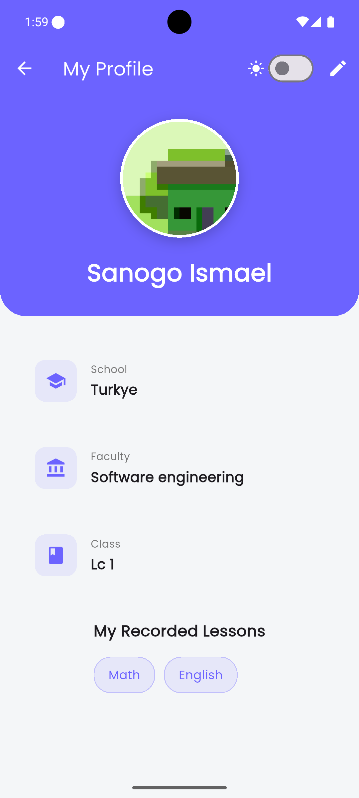
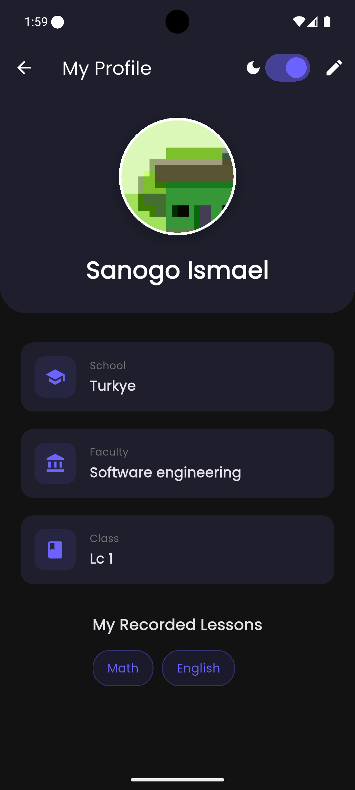

# 🎓 Student Planner (UniFlow)


**UniFlow** is a comprehensive, offline-first mobile application designed to help students organize their academic life. It manages weekly class schedules with reminders, a full notebook-based note-taking system, and a student profile — all working 100% offline via a local database, with an optional one-tap sync from an OBS account and full multi-language support.

---

## ✨ Main Features

* 📅 **Weekly Planner:** Clear view of classes day by day (Monday to Sunday), with classes that already ended today automatically dimmed so you can see what's still ahead.
* 🔄 **Optional OBS Account Sync:** Connect your OBS backend account once to pull in your profile, subjects, and full class schedule automatically — no manual data entry required. Manual setup remains available for anyone without an OBS account.
* 📚 **Notes Library — a real digital notebook:**
  * Organize notes into cahiers (notebooks), each with its own consistent color
  * Ruled-paper look for writing and reading notes, just like a real notebook page
  * Pin important notes so they always stay on top
  * Trash with 30-day retention and one-tap restore — nothing is ever deleted by accident
  * Global search across every notebook, plus per-notebook search
  * Tag notes with removable colored chips for fast filtering
  * Attach multiple images (gallery or camera) and files, with captions and full-screen zoomable preview
  * Share images directly from a note
  * Real-time form validation with a live character counter
* 👤 **Student Profile:** Customize your name, school, class, and profile picture.
* 🔔 **Smart Notifications:** Recurring weekly reminders before every class — including classes imported through OBS sync.
* 🎨 **Dynamic Themes:** Full support for **Dark Mode** and **Light Mode**.
* 🌍 **Multilingual:** Available in **French 🇫🇷**, **English 🇺🇸**, and **Turkish 🇹🇷**.
* 🆕 **In-App Update Checker:** Automatically checks GitHub releases and prompts you to update when a new version is available.
* 💾 **Offline-First:** All data is persisted locally with Hive — the app works fully without a network connection; OBS sync is an optional convenience, not a requirement.

---

## 📱 Screenshots

| Welcome page | Home (Schedule) |
|:---:|:---:|
|  |  |

| Course details page | Notes Library |
|:---:|:---:|
|  |  |

| Student Profile | Dark Mode |
|:---:|:---:|
|  |  |


---

## 🛠️ Technologies Used

* **Framework:** [Flutter](https://flutter.dev/)
* **Language:** Dart
* **State Management:** [Provider](https://pub.dev/packages/provider)
* **Local Database:** [Hive](https://pub.dev/packages/hive) (NoSQL, fast and lightweight, fully offline)
* **Secure Storage:** [flutter_secure_storage](https://pub.dev/packages/flutter_secure_storage) (OBS backend URL & API key)
* **Networking:** [http](https://pub.dev/packages/http) (OBS account sync)
* **Image & File Management:** [image_picker](https://pub.dev/packages/image_picker), [file_picker](https://pub.dev/packages/file_picker), [open_filex](https://pub.dev/packages/open_filex)
* **Sharing:** [share_plus](https://pub.dev/packages/share_plus)
* **Internationalization:** flutter_localizations & intl (French, English, Turkish)
* **Notifications:** [flutter_local_notifications](https://pub.dev/packages/flutter_local_notifications) + [flutter_timezone](https://pub.dev/packages/flutter_timezone)
* **In-App Updates:** [package_info_plus](https://pub.dev/packages/package_info_plus) + GitHub Releases API
* **Design:** Google Fonts, Hero Animations, custom-painted ruled-paper notebook UI
* **Architecture:**
  * Clean code with reusable components (`UIConstants`, services, mixins, widgets)
  * Singleton services (`ImageManager`, `NotificationService`, `ApiConfigService`, `FullSyncService`)
  * Mixin-based form validation
  * Modular, testable widget architecture with unit test coverage on the sync logic

---

## 🎯 Recent Improvements

### Notes Library Overhaul (July 2026)
* **Trash & restore:** notes are soft-deleted first and auto-purged after 30 days, with an "Undo" snackbar and a dedicated trash screen
* **Pin notes** to keep the important ones at the top of a notebook
* **Global search** across all notebooks, in addition to the existing per-notebook search
* **Redesigned note editor and viewer:** ruled-paper background, colored per-notebook accents, chip-based tag input, and a colored notebook picker — the whole Notes section now feels like an actual notebook instead of a plain form
* Fixed a latent bug where editing and saving a note would silently unpin it

### OBS Account Sync (2026)
* One-tap onboarding flow to import profile, subjects, and full class schedule from an OBS backend account
* Structured, resilient sync with per-step error handling, a 60-second timeout, and clear messages for expired sessions, unreachable backend, or network issues
* Automatic notification scheduling for every class imported via sync
* Secure credential storage via `flutter_secure_storage`

### Code Optimization (February 2026)
* **~260 lines of duplicate code eliminated**
* **Created reusable components:**
  * `UIConstants` - Centralized UI constants (spacing, sizes, colors, durations)
  * `ImageManager` - Singleton service for all image operations
  * `FormValidationMixin` - Reusable real-time form validation
  * `ImageGridWidget` - Flexible image gallery component
* **100% localized** - No hardcoded text, all strings use l10n keys across French, English and Turkish
* **Clean architecture** - Following Flutter best practices and DRY principles

---

## 📥 Download the APK

You can test the app on your Android phone by downloading the latest version:

👉 **[Download the latest release](https://github.com/Ismael-sang98/Uni_Flow_app/releases)**

*Choose version `arm64-v8a` for newer phones.*

---

## 🚀 Developer Setup

If you want to clone and modify this project:

1. **Clone the repository:**
```bash
git clone https://github.com/Ismael-sang98/Uni_Flow_app.git
```

2. **Install dependencies:**
```bash
flutter pub get
```

3. **Build Hive and translation files:**
```bash
flutter pub run build_runner build --delete-conflicting-outputs
flutter gen-l10n
```

4. **Run the application:**
```bash
flutter run
```

> OBS account sync is optional — the app works fully offline without configuring a backend URL/API key.

### 📦 Key Dependencies

```yaml
dependencies:
  # State Management
  provider: ^6.1.5+1

  # Local Storage
  hive: ^2.2.3
  hive_flutter: ^1.1.0
  flutter_secure_storage: ^10.3.1

  # Networking (optional OBS sync)
  http: ^1.2.0

  # Images & Files
  image_picker: ^1.2.1
  file_picker: ^8.3.7
  open_filex: ^4.5.0
  path_provider: ^2.1.5
  share_plus: ^10.1.0

  # UI
  google_fonts: ^8.0.0
  table_calendar: ^3.2.0

  # Notifications
  flutter_local_notifications: ^20.1.0
  flutter_timezone: ^5.0.1
  permission_handler: ^12.0.1

  # Updates
  package_info_plus: ^8.0.0
  url_launcher: ^6.3.0

  # Localization
  intl: ^0.20.2
  flutter_localizations:
    sdk: flutter

dev_dependencies:
  hive_generator: ^2.0.1
  build_runner: ^2.4.6
  flutter_lints: ^6.0.0
```

---

Made with ❤️ using Flutter.
